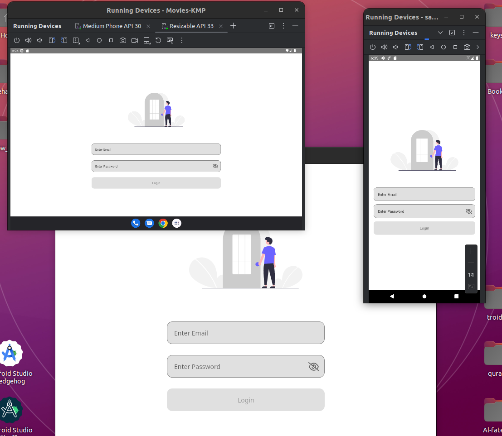
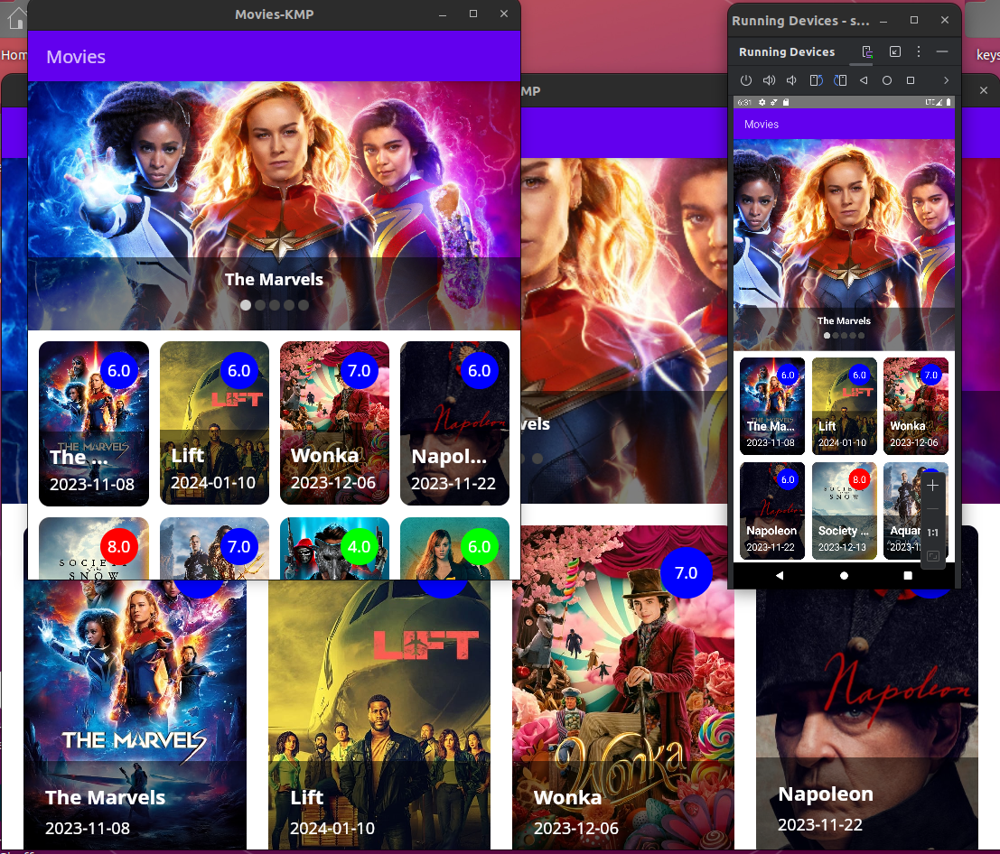

## Kotlin Multiplatform project targets Android, iOS, Desktop and Web.
### Note: The iOS version is not ready yet because I don't have MAC :ghost:

## Compose Multiplatform AWESOME :partying_face: :partying_face: :partying_face:

  
  

## Libraries
- [Compose Multiplatform](https://www.jetbrains.com/lp/compose-multiplatform) for writing only single code for all platforms.
- [Material 3 Window Size Class](https://github.com/chrisbanes/material3-windowsizeclass-multiplatform) for building Adaptive Design.
- [Ktor client](https://ktor.io/docs/create-client.html) for handling network requests.
- [SqlDelight](https://github.com/cashapp/sqldelight) for saving cached movies.
- [Koin](https://insert-koin.io/docs/reference/koin-mp/kmp/) for dependency management.
- [Coil3](https://coil-kt.github.io/coil/upgrading_to_coil3) for loading images.
- [Voyager](https://voyager.adriel.cafe) for easily handling navigation on all platforms.
- [Multiplatform Settings](https://github.com/russhwolf/multiplatform-settings) for saving key-value pairs.
- [MOKO resources](https://github.com/icerockdev/moko-resources) Access shared resources (like images, fonts, and strings) on all platforms.

## Feature
- Shared UI and logic for Android, iOS, Desktop and Web.
- [Adaptive Design](https://www.netguru.com/blog/multiplatform-adaptive-ui)
- Clean architecture (MVI)
- Custom Handling paging data.
- Config changes handling.
- Caching.

## Project structure
* `/composeApp` is for code shared across your Compose Multiplatform applications.
  It contains several subfolders:
  - `commonMain` is for code that’s common for all targets.
  - Other folders are for Kotlin code that will be compiled for only the platform indicated in the folder name.
    For example, if you want to use Apple’s CoreCrypto for the iOS part of your Kotlin app,
    `iosMain` would be the right folder for such calls.

* `/iosApp` contains iOS applications. Even if you’re sharing your UI with Compose Multiplatform, 
  you need this entry point for your iOS app. This is also where you should add SwiftUI code for your project.

## How to run

### Android
To run the application on an Android device/emulator just hit the run button.

### Desktop
To run the desktop application write this to Android studio terminal: `./gradlew :composeApp:run`

### Web
To run the Web application write this to Android studio terminal: `./gradlew wasmJsBrowserRun -t`
Once the application starts, open the following URL in your browser: `http://localhost:8081/`

